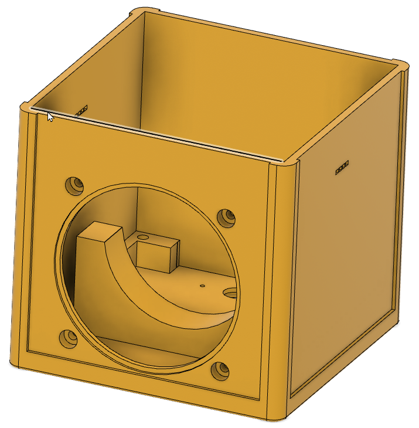
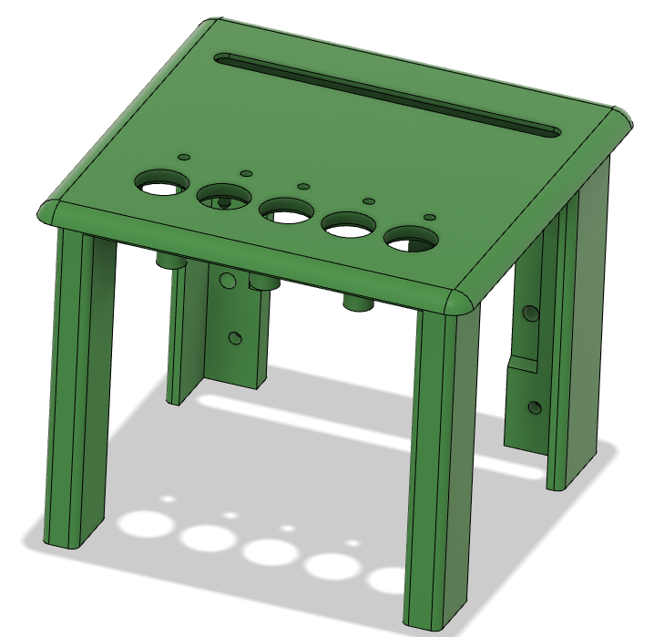
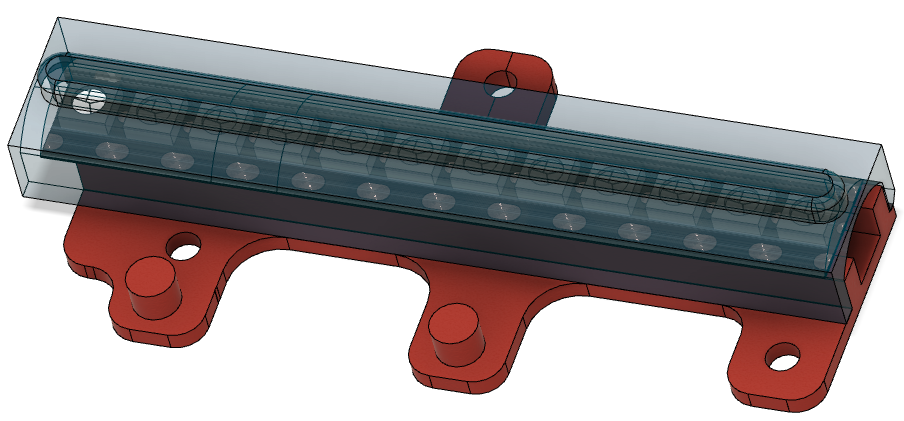
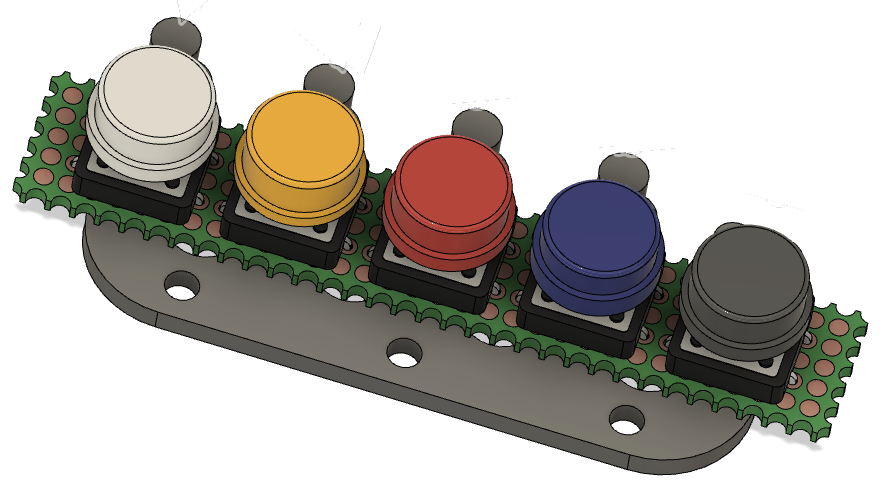
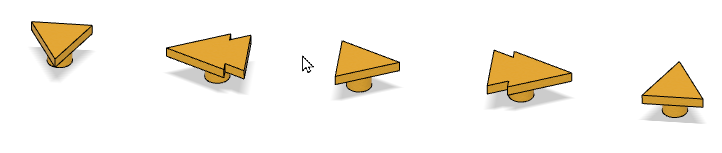
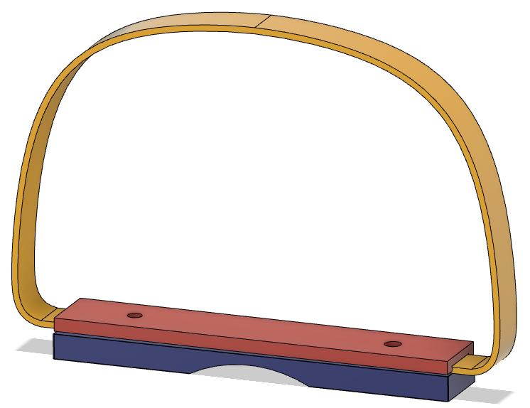
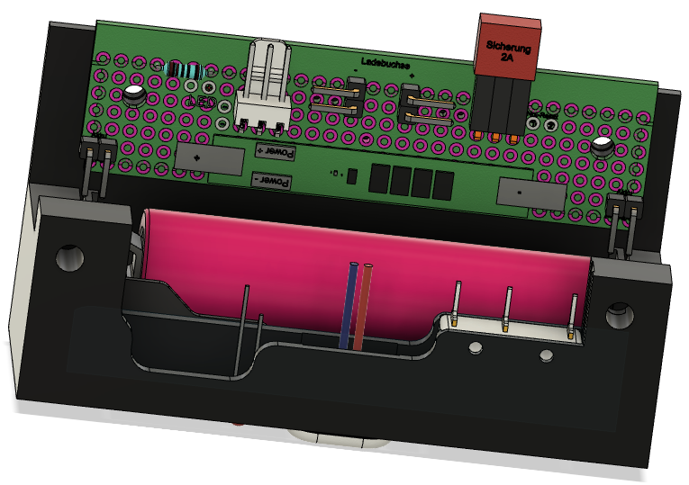

# Gehäuse
Um die Elektronik ansprechend und kindgerecht zu verpacken, wurde ein Gehäuse für den 3D-Druck entwickelt.

Die zum Druck notwendigen STL-Dateien wurden mit der Lizenz von Fusion 360 für Privatanweder erstellt. Diese kann nach einer Registrierung [hier](https://www.autodesk.de/products/fusion-360/personal-form) kostenlos heruntergeladen werden.

Die vollständigen Konstruktionsdaten zum Import in Fusion 360 stelle ich [hier](Gehäuse/ESPuino-Jolibox.f3z) zur Verfügung. Dort kann dann die Konstruktion der Box an die eigenen Wünsche angepasst werden.

Falls die Box ohne Anpassungen gedruckt werden soll, stelle ich nachfolgend die dafür notwendigen STL-Dateien zur Verfügung.

##### Box Unterteil

>[Gehäuse_Unterteil.stl](Gehäuse/Gehäuse_Unterteilteil.stl)

> :information_source: Die vier senkrechten Seiten der Box wurden mit 1mm starkem, farblich unterschiedlichem Filz beklebt ([z.B. Amazon-Link](https://www.amazon.de/gp/product/B01MDNM6D7/ref=ppx_yo_dt_b_search_asin_title?ie=UTF8&psc=1)). Der Filz wurde mit Sprühkleber befestigt. 
> Alternativ können auch entsprechende Abdeckungen mit dem 3D-Drucker erstellt werden. 
 
##### Box Oberteil

>[Gehäuse_Oberteil.stl](Gehäuse/Gehäuse_Unterteilteil.stl)
##### LED-Halter

>[LED-Halter-Aussen.stl](Gehäuse/LED-Halter-Aussen.stl)
>[LED-Halter-Deckel.stl](Gehäuse/LED-Halter-Deckel.stl)
##### Tastatur-Halter

>[Tastaturhalter.stl](Gehäuse/Tastaturhalter.stl)
##### Tastatur-Symbole

>[Symbole.stl](Gehäuse/Symbole.stl)
##### Tragegurtverschluss

>[Tragegurtverschluss-oben.stl](Gehäuse/Tragegurtverschuss-oben.stl)
>[Tragegurtverschluss-unten.stl](Gehäuse/Tragegurtverschluss-unten.stl)

> :information_source: Für den Tragegurt wurde farbiges Gurtband von 10mm Breite und 1,5mm Stärke benutzt ([z.B. Amazon-Link](https://www.amazon.de/gp/product/B0BNJCMKBM/ref=ppx_yo_dt_b_search_asin_title?ie=UTF8&psc=1)).
##### Träger-Stromversorgung

>[TrägerStromversorgung.stl](Gehäuse/TrägerStromversorgung.stl)

