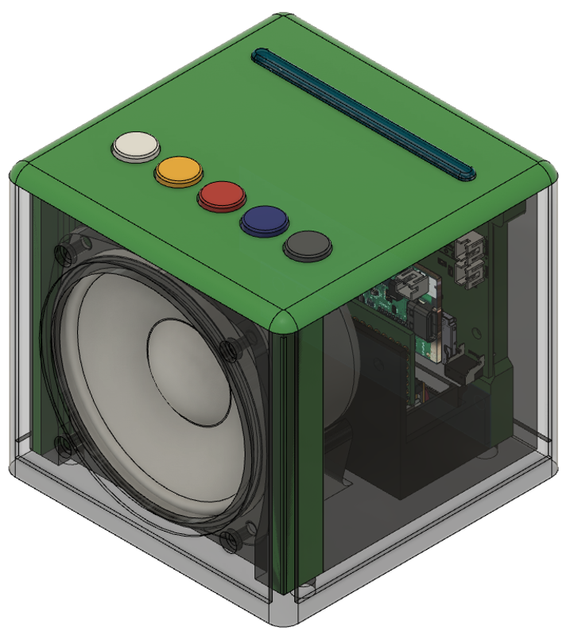
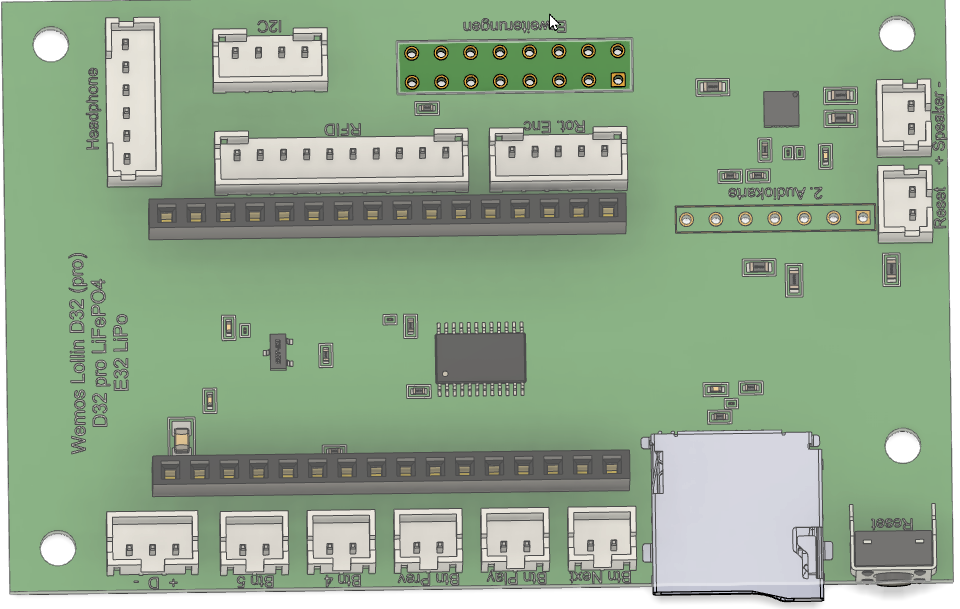
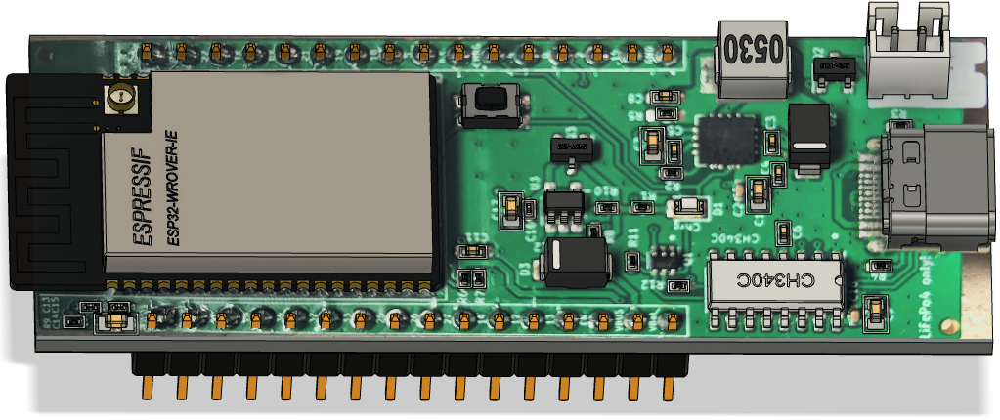
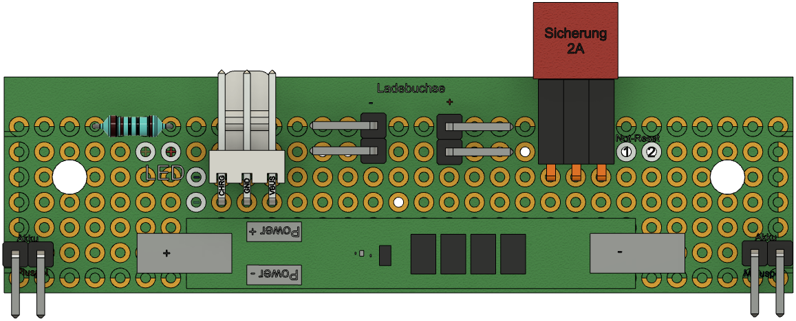
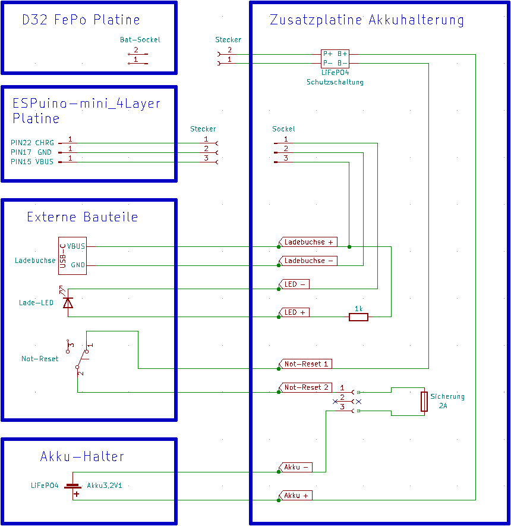
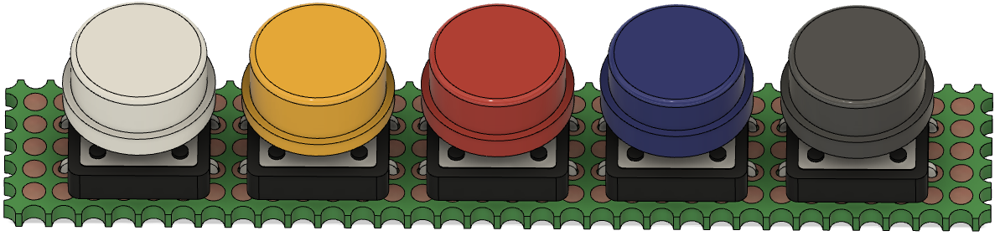

# Technikhandbuch


Harald Woizischke
info@woizischke.de


Technische Beschreibung einer Kinder-Musikbox auf Basis eines ESP32. 
Kinder können die Musik oder Hörspiele mit Rfid-Tags auswählen.
Die Konfiguration der Box erfolgt über eine Webschnittstelle im Browser.

# Einleitung
Dieses Dokument beschreibt alle zum Bau notwendigen Komponenten.
Die Gehäuseteile wurden mit Autocad Fusion 360 entworfen und mit einem 3D-Drucker in PLA gedruckt.
Als Systemplattform wurde die Lösung von Torsten Stauder (biologist) gewählt. Einzelheiten zum Projekt sind im Internet unter https://forum.espuino.de/ zu finden.

# Hardware
## Elektronik Baugruppen
Es wurden folgende Baugruppen und Bauteile zur Realisierung eingesetzt.
- ESPuino-mini 4Layer von biologist - https://forum.espuino.de/t/espuino-mini-4layer/1661/1
- D32 pro FePo. von biologist - https://forum.espuino.de/t/develboard-d32-pro-lifepo4/1109
- Tastatur auf Lochrasterplatine. Tasten aus Set - https://de.aliexpress.com/item/1005003510575948.html?spm=a2g0o.order_list.order_list_main.16.d9f15c5fe9UN4b&gatewayAdapt=glo2deu
- Akku 18650 3.2V 2.000mAh LiFePO4 - https://www.eremit.de/p/18650-3-2v-2-000mah-lifepo4
- Zusatzplatine für Akkuhalterung auf Lochrasterplatine
- Visaton vs-f8sc/8 Lautsprecher - https://www.amazon.de/dp/B0056BQXCW?psc=1&ref=ppx_yo2ov_dt_b_product_details
- RFID-Reader RC522
- 12 LED aus 5v RGB LED-Streifen WS2812B 144 Pixel/m - https://www.amazon.de/gp/product/B08P6XN49P/ref=ppx_yo_dt_b_search_asin_title?ie=UTF8&psc=1 
- 3mm LED rot für Ladeanzeige
- USB-C Ladebuchse - https://de.aliexpress.com/item/1005004913934656.html?spm=a2g0o.order_list.order_list_main.26.d9f15c5fe9UN4b&gatewayAdapt=glo2deu
- Micro-Switch für Not-Reset - https://www.amazon.de/VILLCASE-Endschalter-Scharnierhebel-Steuerung-Mikroschalter/dp/B08H52SDG2/ref=d_pd_sbs_sccl_3_3/260-8649301-8058855?pd_rd_w=cNDNg&content-id=amzn1.sym.41628bd4-d899-4783-a506-d8de0d1214b9&pf_rd_p=41628bd4-d899-4783-a506-d8de0d1214b9&pf_rd_r=3GDTZH136VNYB0NSFS06&pd_rd_wg=YOhk4&pd_rd_r=c7a0bea7-4bae-44c3-859b-27eb5bccfb86&pd_rd_i=B08H52SDG2&psc=1 
- Amazon BASIC PLA - https://www.amazon.de/gp/product/B07CTQDQ77/ref=ppx_yo_dt_b_search_asin_title?ie=UTF8&psc=1

## ESPuino-mini_4Layer
 

## D32_FePo_rev4


## Kabelplan

### RFID-Reader 5180
```
Stecker         Farbe           PN5180
5V     ------   sw   ---------  5V
3.3V   ------   rt   ---------  3.3	
RST    ------   ws   ---------  RST
CS     ------   ge   ---------  NSS
MOSI   ------   or   ---------  MOSI
MISO   ------   gn   ---------  MISO
SCK    ------   bl   ---------  SCK
BSY    ------   vi   ---------  BUSY
IRQ    ------   gr   ---+  +--  GND
GND    ------   br   ---|--+    GPIO
                        +----   IRQ
                                AUX
                                REQ 
```

### Rotary-Encoder
```
Stecker     Farbe           Encoder
DT  -----   sw   -+    +-  CLK
CLK -----   rt   -+----+-  DT
BTN -----   ws   --------  SW
3.3 -----   ge   --------  +
GND -----   or   --------  GND
```

### NeoPixel
```
Stecker     Farbe          LED-Stripe	
-   -----   rt    -------  -	
D1  -----   sw    -------  D0
+   -----   ge    -------  5V
```

## Zusatzplatine Akkuhalterung
Für den Anschuss von der Lade LED, dem Not-Reset-Schalter, der Ladebuchse und der Schutzschaltung für den Akku wurde eine Lochrasterplatine verwendet.



## Tastatur


# Software
## Beschreibung des dynamischen Button-Layout
Ursprünglich war in der Firmware des ESPuino fest verankert, dass die Bedienung über drei Tasten und einem Drehencoder zu erfolgen hat. Die Bedienung/Bedeutung der jeweiligen Tasten war dabei vorgegeben. Dies hat sich nun geändert: Tasten können nun wahlweise hinzugefügt und entfernt werden. Auch ist der Drehencoder nun optional.
An dieser Stelle sei erwähnt, dass das von mir empfohlene (und benutzte) Layout weiterhin drei Taster und ein Drehencoder ist. 
- Als neue Direktive in settings.h ist USEROTARY_ENABLE hinzugekommen. Wird kein Drehencoder gebraucht, so kann dies deaktiviert werden. Hinweis: Ist dies der Fall, so muss in der jeweiligen Develboard-spezifischen Config unbedingt WAKEUP_BUTTON angepasst werden.
- Mit dem eben bereits angesprochenen WAKEUP_BUTTON kann festgelegt werden, mit welcher Taste der ESPuino wieder aus dem Tiefschlaf geholt werden soll. Es ist an dieser Stelle darauf zu achten, dass nur sog. RTC-GPIOs 1 (0, 4, 12, 13, 14, 15, 25, 26, 27, 32, 33, 34, 35, 36, 39) verwendbar sind. Es können an dieser Stelle direkt Zahlen reingeschrieben werden oder aber z.B. auch Namen wie DREHENCODER_BUTTON oder NEXT_BUTTON. Soll dieses Feature deaktiviert werden, so ist eine 99 zu setzen. Nicht auskommentieren!
- In der Develboard-spezifischen Config sind die Tasten BUTTON_4 und BUTTON_5 hinzugekommen. Per Voreinstellung sind sie deaktiviert (99). Im Gegenzug können jedoch auch NEXT_BUTTON, PREVIOUS_BUTTON oder PAUSEPLAY_BUTTON wahlweise aktiviert oder deaktiviert werden.
- In settings.h können den Tastern nun beliebige Aktionen zugewiesen werden. Hierbei ist zu unterscheiden, ob es sich um eine Tastenkombination aus zwei Tasten (MULTI_n_SHORT) oder um eine einzige Taste (BUTTON_n_SHORT oder BUTTON_n_LONG) handelt. D.h. jeder einzelnen Taste kann man eine Aktion für kurzen Tastendruck und eine für langen Tastendruck zuweisen.
- Möchte man einer Taste keine Aktion zuweisen, so ist die Direktive CMD_NOTHING zu setzen. Dies muss entsprechend für einen kurzen und/oder langen Tastendruck gemacht werden.

Möchte man einer Taste eine Aktion zuweisen, so sind folgende Aktionen möglich (siehe values.h):

|Kommando	|Beschreibung|
------------|------------|
|CMD_LOCK_BUTTONS_MOD	|Sperrt alle Tasten und gibt sie [theoretisch] wieder frei. Macht als Tastenbelegung eher nicht so viel Sinn, da man mit gesperrten Tasten keine Tastenaktion mehr auslösen kann. Ist eher eine Aktion für Modifikationskarten.
|CMD_SLEEP_TIMER_MOD_15	|Schaltet sich nach 15 Minuten aus und LEDs werden gedimmt
|CMD_SLEEP_TIMER_MOD_30	|Schaltet sich nach 30 Minuten aus und LEDs werden gedimmt
|CMD_SLEEP_TIMER_MOD_60	|Schaltet sich nach 60 Minuten aus und LEDs werden gedimmt
|CMD_SLEEP_TIMER_MOD_120	|Schaltet sich nach 120 Minuten aus und LEDs werden gedimmt
|CMD_SLEEP_AFTER_END_OF_TRACK	|Schaltet sich nach Ende des Titels aus und LEDs werden gedimmt
|CMD_SLEEP_AFTER_END_OF_PLAYLIST	|Schaltet sich nach Ende der Playlist aus und LEDs werden gedimmt
|CMD_SLEEP_AFTER_5_TRACKS	|Schaltet sich nach Ende von fünf Titeln aus und LEDs werden gedimmt
|CMD_REPEAT_PLAYLIST	|Aktuelle Playlist wird endlos wiederholt
|CMD_REPEAT_TRACK	|Aktueller Titel wird endlos wiederholt
|CMD_DIMM_LEDS_NIGHTMODE	|Dimmt LEDs in Nachtmodus
|CMD_TOGGLE_WIFI_STATUS	|Schaltet WLAN an/aus
|CMD_TOGGLE_BLUETOOTH_SINK_MODE	|Schaltet den Bluetooth-Modus an/aus, bei dem man zu ESPuino streamen kann (z.B. von einem Handy).
|CMD_TOGGLE_BLUETOOTH_SOURCE_MODE	|Schaltet den Bluetooth-Modus an/aus, bei dem man von ESPuino zu einem externen Lautsprecher oder einem Kopfhörer streamen kann.
|CMD_ENABLE_FTP_SERVER	|Schaltet FTP-Server an (aus geht nicht)
|CMD_PLAYPAUSE	|Wechsel zwischen Pause und Play
|CMD_PREVTRACK	|Vorheriger Titel der aktuellen Playlist
|CMD_NEXTTRACK	|Nächster Titel der aktuellen Playlist
|CMD_FIRSTTRACK	|Sprung zu erstem Titel der aktuellen Playlist
|CMD_LASTTTRACK	|Sprung zu letztem Titel der aktuellen Playlist
|CMD_VOLUMEINIT	|Stellt aktuelle Lautstärke auf Lautstärke nach dem Start ein
|CMD_VOLUMEUP	|Erhöht Lautstärke um eine Einheit
|CMD_VOLUMEDOWN	|Reduziert Lautstärke um eine Einheit
|CMD_MEASUREBATTERY	|Startet Messung der Akkuspannung (wird über Log, Neopixel und MQTT anschließend ausgegeben)
|CMD_SLEEPMODE	|Schaltet ESPuino sofort aus
|CMD_SEEK_FORWARDS	|Springt n Sekunden nach vorne im Titel (Dauer in settings.h konfigurierbar
|CMD_SEEK_BACKWARDS	|Springt n Sekunden nach hinten im Titel (Dauer in settings.h konfigurierbar
