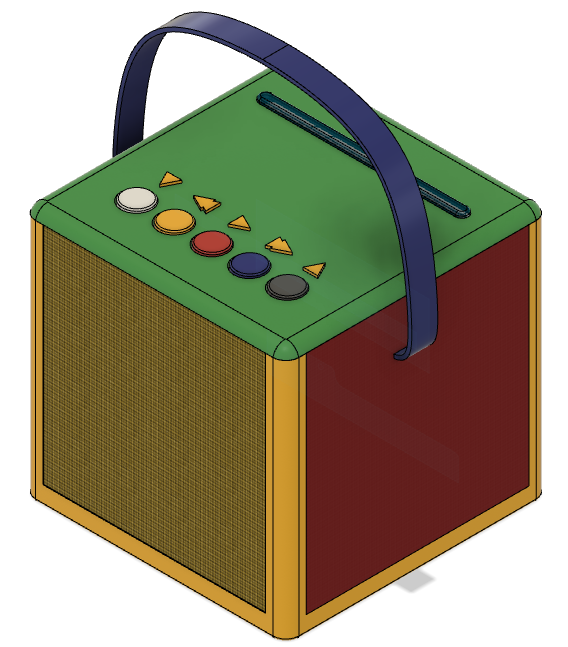

# Jolibox
## Ein mit RFID-Karten steuerbarer Audioplayer

Auf Bais der [Software ESPuino](https://forum.espuino.de/c/software/7) und der [Hardware (ESPuino-mini 4Layer + D32 pro FePo)](https://forum.espuino.de/t/espuino-mini-4layer/1661) von [biologist79](https://github.com/biologist79/ESPuino) habe ich einen kindgerechten Auidioplayer entwickelt. 

Die Druckdateien für das Gehäuse wurden mit der kostenlosen Version von Fusion 360 erstellt und anschließend mit einem 3D-Drucker ausgedruckt. So entstand ein 'kinderleicht' zu bedienender Audioplayer für meine 2-jährige Enkeltochter. Die Titelauswahl kann sie mit den programmierten RFID-Karten selbst vornehmen. 

Die gesamte Administration des Audioplayers erfolgt über eine Webseite mit einem beliebigen Browser durch die Eltern.

---

- [Benutzerhandbuch](Dokumentation/Benutzerhandbuch.md)
- [Technikhandbuch](Dokumentation/Technikhandbuch.md)
- [Anpassungen der Konfigurationsdateien](Dokumentation/Konfiguration.md)
- Bauteile
- Gehäuse
- [Deutsche Übersetzung der README.md aus dem biologist79-Repository](Dokumentation/README.md-biologist.md)

